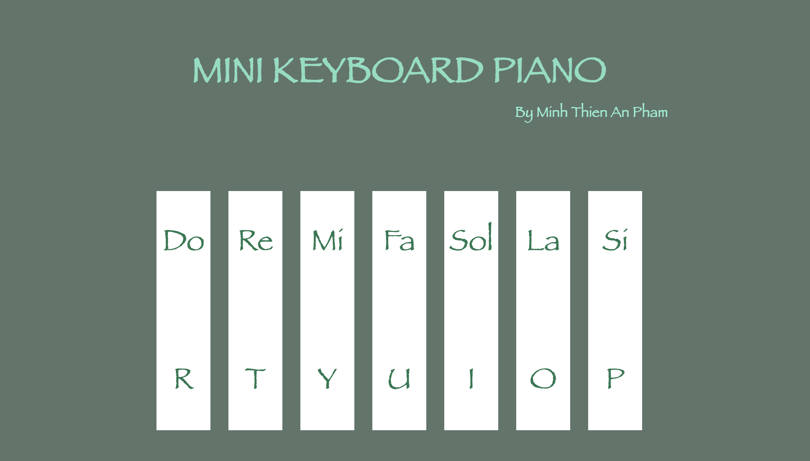

# Mini Keyboard Piano

## Introduction:
Mini Keyboard Piano is a cute, simple website modifies the piano's keys and notes by using keys on device's keyboard. The website focuses mostly on creating a fun and relaxing moments for users by playing around with the virtual piano.

## Features:
- 7 piano notes: Do, Re, Mi, Fa, Sol, La, Si
- 7 keyboard keys: R, T, Y, U, I, O, P
- Note is played when pressing the according key and can be played without waiting for the previous note to finish

## How to play:
Press the keys R, T, Y, U, I, O, P on your keyboard to play the notes Do, Re, Mi, Fa, Sol, La, Si, accordingly.